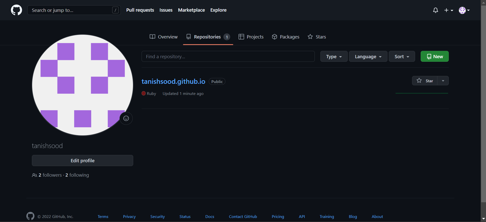
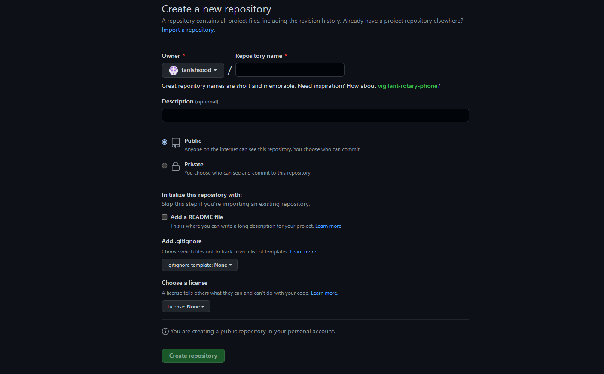
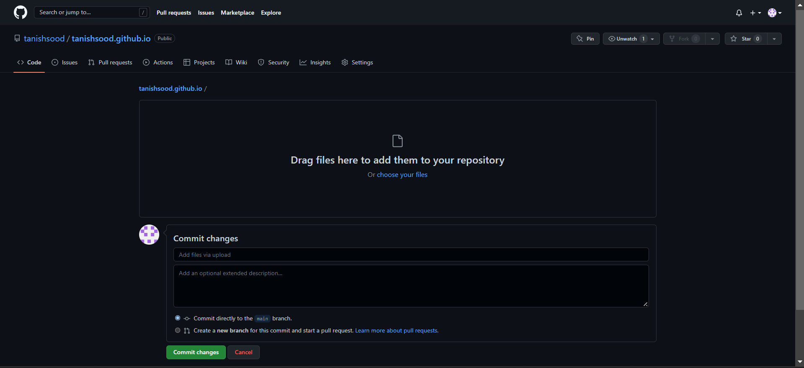
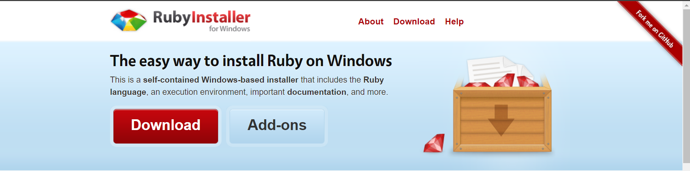
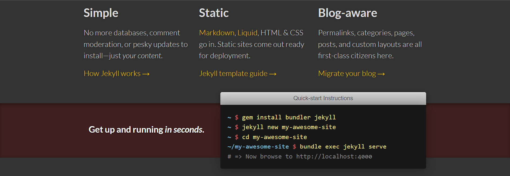
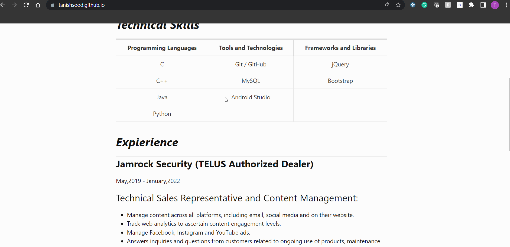

# How to host a resume formatted in markdown on GitHub

## **Purpose**
---
 The practical steps of how to host and format a resume using Markdown, a Markdown editor, GitHub pages, and Jekyll. And relate these practical steps to the general principles of current Technical Writing, as explained in Andrew Etter's book Modern Technical Writing.

## **Prerequisites**
---
The only prerequisite is a resume formatted in markdown. To create a resume in markdown format you need to have knowledge of markdown language and for reference, I have added a link to a great markdown tutorial under the "More Resources" section.

## **Instructions**
---
### **Use Lightweight Markup Language**
According to Andrew Etter, one of the tenets of modern technical writing is that everyone is a contributor. And one of the main disadvantages of storing content directly in XML-based languages is that it limits people's ability to contribute. This is where lightweight markup languages excel.

Markdown is the most widely used lightweight markup language and has the cleanest syntax. The most popular is GitHub Flavoured Markdown. He also suggests that some of the best text editors are MarkdownPad, iA Writer, and ReText. 
### **Using Distributed Version Control to upload documents** 
According to Andrew Etter, version control systems are designed for software development, each and every one of them is overkill for the typical documentation workflow. The benefits of using distributed version control sysytems are:
* These have better performance.
* These allow for offline work.
* These are way superior for concurrent work on the same file.

In terms of documentation, Andrew Etter suggests storing the documentation in the same repository as its corresponding product source code. The Readme.md should always be placed in the root of the repository.

The Readme.md should include a quick summary of documented product, and  instructions on building documentation locally and on how to contribute.

We will use GitHub to host our Resume.md. 
### Begin:
* The first step is to have an account on GitHub, if you are not already signed up, you can signup [here](https://github.com/signup?source=login).

* After creating an account or if you already have an account on GitHub, follow the instructions below to upload your markdown formatted resume:
    * Click on your profile picture.
    * Now from the dropdown menu choose your repositories.
    * Click on the new button in green colour.
    
    * Fill out the the name for your repository and select public.
    
    * Click on Create Repository button in green.
    * Click on addfile and from drop-down menu select upload files.
    
    * Now you can either drag or choose your markdown formatted resume file.
    * Click on commit changes button in green.

### **Hosting a static website**
Andrew Etter, the author of the book Modern Technical Writing has an irrational bias towards static websites. The advantages that he states are:
* They have no server-side application dependencies.
* There are no databases.
* There is nothing to install.
* These can be tested on your local computer without installing anything.

Some of the static site generators that Anderew Etter suggests are:
* Jekyll
* Hugo
* Sphinx

We will be using Jekyll to host our static website. Follow the instruction below to host our static website:
#### 1. Installing Ruby
*  To install Ruby click here [Ruby](https://www.ruby-lang.org/en/downloads/).
* Now under Ways of Installing Ruby click on RubyInstaller for Windows machines.

* Click on the big red download button.

* Click on the first link named "=>Ruby+Devkit 3.1.2-1(x64)" under WITH DEVKIT.
* Once the installation is done complete the setup.

#### 2. Installing Jekyll
* To install Jekyll click here [Jekyll](https://jekyllrb.com/).
* Now open command prompt from the windows start menu.

* Type `gem install bundler jekyll` for reference you can look at quick start instructions from the above link.
* Now to confirm if jekyll is installed type `jekyll -v`. You should see the version of the jekyll which confirms that it is installed on your device otherwise you will get an error if not installed.

#### 3. Clone GitHub
* Open the command prompt and type `git clone https://github.com/[YourGitHubUsername]/[YourGitHubUsername].github.io`.

#### 4. Creating Website
* On the command prompt open the cloned directory by typing `cd[YourGitHubUsername].github.io`.
* Now to initialize the website, type `jekyll new[ChooseAnyNameForYOurWebsite]` in the command prompt.
* Switch to your website directory by using the command `cd[YourWebsiteName]`.
* Now you need to install the webrick bundle by typing `bundle add webrick` command first and then typing `install bundle` command in the command prompt.
* Now to open the website, which you just created, in the command prompt type `bundle exec jekyll serve` command.
* To view your website, in your browser search "https://loaclhost:4000".
* Now push the required files using the Git desktop application or by typing these commands in the command prompt:
    * `git add --all` 
    * `git commit -m "YourCommitMessage"` 
    * `git push -u origin main`
*  To view your website open "https://[YourGitHubUsername].github.io" in your browser.

#### This is what your website would look like.
\

## **More Resources**
-----------------------
1. This [Markdown Tutorial](https://www.markdowntutorial.com/) is a great resource for learning markdown.
2. Andrew Etter's Modern Technical is a great read for understanding the concepts of technical writing. You can find [Etter's book](https://www.amazon.ca/Modern-Technical-Writing-Introduction-Documentation-ebook/dp/B01A2QL9SS) on Amazon.
3. This [Git Tutorial](https://www.w3schools.com/git/) helped me understand Git. It is very thorough and goes very in depth.

## **Authors and Acknowledgments**
---
This Readme.md is written by Tanish Sood.

I would like to thank my group members for helping me understand things and giving me proper feedback.
The names of my group members are:
1. Wen, Chu Hao
2. Armijos, Juan
3. Patel, Khush Bhrugesh

## **FAQs**
---
### Q1. Why is Markdown better than a word processor?
One of the main reasons that make markdown better than a word processor is formatting options. Markdown can also be used for writing text documents, presentable slides and many other things.

### Q2. Why is my resume not showing up?
One of the reasons for the resume not showing up could be the wrong prefix. Make sure your markdown formatted resume file has the prefix of the previous date and time.
